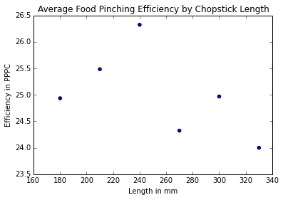

# Chopsticks!

A few researchers set out to determine the optimal length of chopsticks for children and adults. They came up with a measure of how effective a pair of chopsticks performed, called the "Food Pinching Performance." The "Food Pinching Performance" was determined by counting the number of peanuts picked and placed in a cup (PPPC).

### An investigation for determining the optimum length of chopsticks.
[Link to Abstract and Paper](http://www.ncbi.nlm.nih.gov/pubmed/15676839)  
*the abstract below was adapted from the link*

Chopsticks are one of the most simple and popular hand tools ever invented by humans, but have not previously been investigated by [ergonomists](https://www.google.com/search?q=ergonomists). Two laboratory studies were conducted in this research, using a [randomised complete block design](http://dawg.utk.edu/glossary/whatis_rcbd.htm), to evaluate the effects of the length of the chopsticks on the food-serving performance of adults and children. Thirty-one male junior college students and 21 primary school pupils served as subjects for the experiment to test chopsticks lengths of 180, 210, 240, 270, 300, and 330 mm. The results showed that the food-pinching performance was significantly affected by the length of the chopsticks, and that chopsticks of about 240 and 180 mm long were optimal for adults and pupils, respectively. Based on these findings, the researchers suggested that families with children should provide both 240 and 180 mm long chopsticks. In addition, restaurants could provide 210 mm long chopsticks, considering the trade-offs between ergonomics and cost.

### For the rest of this project, answer all questions based only on the part of the experiment analyzing the thirty-one adult male college students.
Download the [data set for the adults](https://www.udacity.com/api/nodes/4576183932/supplemental_media/chopstick-effectivenesscsv/download), then answer the following questions based on the abstract and the data set.

**If you double click on this cell**, you will see the text change so that all of the formatting is removed. This allows you to edit this block of text. This block of text is written using [Markdown](http://daringfireball.net/projects/markdown/syntax), which is a way to format text using headers, links, italics, and many other options. You will learn more about Markdown later in the Nanodegree Program. Hit shift + enter or shift + return to show the formatted text.

#### 1. What is the independent variable in the experiment?

Chopstick.Length

#### 2. What is the dependent variable in the experiment?

Food.Pinching.Efficiency


#### 3. How is the dependent variable operationally defined?


The "Food Pinching Performance" was determined by counting the number of peanuts picked and placed in a cup (PPPC)

#### 4. Based on the description of the experiment and the data set, list at least two variables that you know were controlled.

Age of the samples, The type of food .

One great advantage of ipython notebooks is that you can document your data analysis using code, add comments to the code, or even add blocks of text using Markdown. These notebooks allow you to collaborate with others and share your work. For now, let's see some code for doing statistics.


```python
import pandas as pd

# pandas is a software library for data manipulation and analysis
# We commonly use shorter nicknames for certain packages. Pandas is often abbreviated to pd.
# hit shift + enter to run this cell or block of code
```


```python
path = 'chopstick-effectiveness.csv'
# Change the path to the location where the chopstick-effectiveness.csv file is located on your computer.
# If you get an error when running this block of code, be sure the chopstick-effectiveness.csv is located at the path on your computer.

dataFrame = pd.read_csv(path)
dataFrame
```


<div style="max-height:1000px;max-width:1500px;overflow:auto;">
<table border="1" class="dataframe">
  <thead>
    <tr style="text-align: right;">
      <th></th>
      <th>Food.Pinching.Efficiency</th>
      <th>Individual</th>
      <th>Chopstick.Length</th>
    </tr>
  </thead>
  <tbody>
    <tr>
      <th>0 </th>
      <td> 19.55</td>
      <td>  1</td>
      <td> 180</td>
    </tr>
    <tr>
      <th>1 </th>
      <td> 27.24</td>
      <td>  2</td>
      <td> 180</td>
    </tr>
    <tr>
      <th>2 </th>
      <td> 28.76</td>
      <td>  3</td>
      <td> 180</td>
    </tr>
    <tr>
      <th>3 </th>
      <td> 31.19</td>
      <td>  4</td>
      <td> 180</td>
    </tr>
    <tr>
      <th>4 </th>
      <td> 21.91</td>
      <td>  5</td>
      <td> 180</td>
    </tr>
    <tr>
      <th>5 </th>
      <td> 27.62</td>
      <td>  6</td>
      <td> 180</td>
    </tr>
    <tr>
      <th>6 </th>
      <td> 29.46</td>
      <td>  7</td>
      <td> 180</td>
    </tr>
    <tr>
      <th>7 </th>
      <td> 26.35</td>
      <td>  8</td>
      <td> 180</td>
    </tr>
    <tr>
      <th>8 </th>
      <td> 26.69</td>
      <td>  9</td>
      <td> 180</td>
    </tr>
    <tr>
      <th>9 </th>
      <td> 30.22</td>
      <td> 10</td>
      <td> 180</td>
    </tr>
    <tr>
      <th>10</th>
      <td> 27.81</td>
      <td> 11</td>
      <td> 180</td>
    </tr>
    <tr>
      <th>11</th>
      <td> 23.46</td>
      <td> 12</td>
      <td> 180</td>
    </tr>
    <tr>
      <th>12</th>
      <td> 23.64</td>
      <td> 13</td>
      <td> 180</td>
    </tr>
    <tr>
      <th>13</th>
      <td> 27.85</td>
      <td> 14</td>
      <td> 180</td>
    </tr>
    <tr>
      <th>14</th>
      <td> 20.62</td>
      <td> 15</td>
      <td> 180</td>
    </tr>
    <tr>
      <th>15</th>
      <td> 25.35</td>
      <td> 16</td>
      <td> 180</td>
    </tr>
    <tr>
      <th>16</th>
      <td> 28.00</td>
      <td> 17</td>
      <td> 180</td>
    </tr>
    <tr>
      <th>17</th>
      <td> 23.49</td>
      <td> 18</td>
      <td> 180</td>
    </tr>
    <tr>
      <th>18</th>
      <td> 27.77</td>
      <td> 19</td>
      <td> 180</td>
    </tr>
    <tr>
      <th>19</th>
      <td> 18.48</td>
      <td> 20</td>
      <td> 180</td>
    </tr>
    <tr>
      <th>20</th>
      <td> 23.01</td>
      <td> 21</td>
      <td> 180</td>
    </tr>
    <tr>
      <th>21</th>
      <td> 22.66</td>
      <td> 22</td>
      <td> 180</td>
    </tr>
    <tr>
      <th>22</th>
      <td> 23.24</td>
      <td> 23</td>
      <td> 180</td>
    </tr>
    <tr>
      <th>23</th>
      <td> 22.82</td>
      <td> 24</td>
      <td> 180</td>
    </tr>
    <tr>
      <th>24</th>
      <td> 17.94</td>
      <td> 25</td>
      <td> 180</td>
    </tr>
    <tr>
      <th>25</th>
      <td> 26.67</td>
      <td> 26</td>
      <td> 180</td>
    </tr>
    <tr>
      <th>26</th>
      <td> 28.98</td>
      <td> 27</td>
      <td> 180</td>
    </tr>
    <tr>
      <th>27</th>
      <td> 21.48</td>
      <td> 28</td>
      <td> 180</td>
    </tr>
    <tr>
      <th>28</th>
      <td> 14.47</td>
      <td> 29</td>
      <td> 180</td>
    </tr>
    <tr>
      <th>29</th>
      <td> 28.29</td>
      <td> 30</td>
      <td> 180</td>
    </tr>
    <tr>
      <th>30</th>
      <td> 27.97</td>
      <td> 31</td>
      <td> 180</td>
    </tr>
    <tr>
      <th>31</th>
      <td> 23.53</td>
      <td>  1</td>
      <td> 210</td>
    </tr>
    <tr>
      <th>32</th>
      <td> 26.39</td>
      <td>  2</td>
      <td> 210</td>
    </tr>
    <tr>
      <th>33</th>
      <td> 30.90</td>
      <td>  3</td>
      <td> 210</td>
    </tr>
    <tr>
      <th>34</th>
      <td> 26.05</td>
      <td>  4</td>
      <td> 210</td>
    </tr>
    <tr>
      <th>35</th>
      <td> 23.27</td>
      <td>  5</td>
      <td> 210</td>
    </tr>
    <tr>
      <th>36</th>
      <td> 29.17</td>
      <td>  6</td>
      <td> 210</td>
    </tr>
    <tr>
      <th>37</th>
      <td> 30.93</td>
      <td>  7</td>
      <td> 210</td>
    </tr>
    <tr>
      <th>38</th>
      <td> 17.55</td>
      <td>  8</td>
      <td> 210</td>
    </tr>
    <tr>
      <th>39</th>
      <td> 32.55</td>
      <td>  9</td>
      <td> 210</td>
    </tr>
    <tr>
      <th>40</th>
      <td> 28.87</td>
      <td> 10</td>
      <td> 210</td>
    </tr>
    <tr>
      <th>41</th>
      <td> 26.53</td>
      <td> 11</td>
      <td> 210</td>
    </tr>
    <tr>
      <th>42</th>
      <td> 25.26</td>
      <td> 12</td>
      <td> 210</td>
    </tr>
    <tr>
      <th>43</th>
      <td> 25.65</td>
      <td> 13</td>
      <td> 210</td>
    </tr>
    <tr>
      <th>44</th>
      <td> 29.39</td>
      <td> 14</td>
      <td> 210</td>
    </tr>
    <tr>
      <th>45</th>
      <td> 23.26</td>
      <td> 15</td>
      <td> 210</td>
    </tr>
    <tr>
      <th>46</th>
      <td> 24.77</td>
      <td> 16</td>
      <td> 210</td>
    </tr>
    <tr>
      <th>47</th>
      <td> 25.42</td>
      <td> 17</td>
      <td> 210</td>
    </tr>
    <tr>
      <th>48</th>
      <td> 23.65</td>
      <td> 18</td>
      <td> 210</td>
    </tr>
    <tr>
      <th>49</th>
      <td> 32.22</td>
      <td> 19</td>
      <td> 210</td>
    </tr>
    <tr>
      <th>50</th>
      <td> 18.86</td>
      <td> 20</td>
      <td> 210</td>
    </tr>
    <tr>
      <th>51</th>
      <td> 21.75</td>
      <td> 21</td>
      <td> 210</td>
    </tr>
    <tr>
      <th>52</th>
      <td> 23.07</td>
      <td> 22</td>
      <td> 210</td>
    </tr>
    <tr>
      <th>53</th>
      <td> 22.30</td>
      <td> 23</td>
      <td> 210</td>
    </tr>
    <tr>
      <th>54</th>
      <td> 27.04</td>
      <td> 24</td>
      <td> 210</td>
    </tr>
    <tr>
      <th>55</th>
      <td> 22.24</td>
      <td> 25</td>
      <td> 210</td>
    </tr>
    <tr>
      <th>56</th>
      <td> 24.87</td>
      <td> 26</td>
      <td> 210</td>
    </tr>
    <tr>
      <th>57</th>
      <td> 30.85</td>
      <td> 27</td>
      <td> 210</td>
    </tr>
    <tr>
      <th>58</th>
      <td> 21.15</td>
      <td> 28</td>
      <td> 210</td>
    </tr>
    <tr>
      <th>59</th>
      <td> 16.47</td>
      <td> 29</td>
      <td> 210</td>
    </tr>
    <tr>
      <th></th>
      <td>...</td>
      <td>...</td>
      <td>...</td>
    </tr>
  </tbody>
</table>
<p>186 rows × 3 columns</p>
</div>


Let's do a basic statistical calculation on the data using code! Run the block of code below to calculate the average "Food Pinching Efficiency" for all 31 participants and all chopstick lengths.


```python
dataFrame['Food.Pinching.Efficiency'].mean()
```


    25.005591397849461


This number is helpful, but the number doesn't let us know which of the chopstick lengths performed best for the thirty-one male junior college students. Let's break down the data by chopstick length. The next block of code will generate the average "Food Pinching Effeciency" for each chopstick length. Run the block of code below.


```python
meansByChopstickLength = dataFrame.groupby('Chopstick.Length')['Food.Pinching.Efficiency'].mean().reset_index()
meansByChopstickLength

# reset_index() changes Chopstick.Length from an index to column. Instead of the index being the length of the chopsticks, the index is the row numbers 0, 1, 2, 3, 4, 5.
```


<div style="max-height:1000px;max-width:1500px;overflow:auto;">
<table border="1" class="dataframe">
  <thead>
    <tr style="text-align: right;">
      <th></th>
      <th>Chopstick.Length</th>
      <th>Food.Pinching.Efficiency</th>
    </tr>
  </thead>
  <tbody>
    <tr>
      <th>0</th>
      <td> 180</td>
      <td> 24.935161</td>
    </tr>
    <tr>
      <th>1</th>
      <td> 210</td>
      <td> 25.483871</td>
    </tr>
    <tr>
      <th>2</th>
      <td> 240</td>
      <td> 26.322903</td>
    </tr>
    <tr>
      <th>3</th>
      <td> 270</td>
      <td> 24.323871</td>
    </tr>
    <tr>
      <th>4</th>
      <td> 300</td>
      <td> 24.968065</td>
    </tr>
    <tr>
      <th>5</th>
      <td> 330</td>
      <td> 23.999677</td>
    </tr>
  </tbody>
</table>
<p>6 rows × 2 columns</p>
</div>


#### 5. Which chopstick length performed the best for the group of thirty-one male junior college students?

240mm


```python
# Causes plots to display within the notebook rather than in a new window
%pylab inline

import matplotlib.pyplot as plt

plt.scatter(x=meansByChopstickLength['Chopstick.Length'], y=meansByChopstickLength['Food.Pinching.Efficiency'])
            # title="")
plt.xlabel("Length in mm")
plt.ylabel("Efficiency in PPPC")
plt.title("Average Food Pinching Efficiency by Chopstick Length")
plt.show()
```

    Populating the interactive namespace from numpy and matplotlib


    /usr/lib/pymodules/python2.7/matplotlib/collections.py:548: FutureWarning: elementwise comparison failed; returning scalar instead, but in the future will perform elementwise comparison
      if self._edgecolors == 'face':





#### 6. Based on the scatterplot created from the code above, interpret the relationship you see. What do you notice?

240mm has the highest FPE while 180,210 has less and anything more than 240 has less FPE than 240. 330 has the lowest FPE

### In the abstract the researchers stated that their results showed food-pinching performance was significantly affected by the length of the chopsticks, and that chopsticks of about 240 mm long were optimal for adults.

#### 7a. Based on the data you have analyzed, do you agree with the claim?

YES

#### 7b. Why?

240mm ChopsSticks have the higest FPE. 


```python

```
