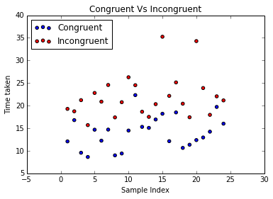
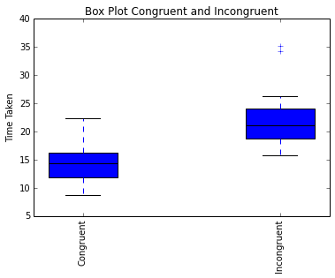

# P1: Test a Perceptual Phenomenon

## Background Information

In a Stroop task, participants are presented with a list of words, with each word displayed in a color of ink. The participant’s task is to say out loud the color of the ink in which the word is printed. The task has two conditions: a congruent words condition, and an incongruent words condition. In the congruent words condition, the words being displayed are color words whose names match the colors in which they are printed: for example RED, BLUE. In the incongruent words condition, the words displayed are color words whose names do not match the colors in which they are printed: for example PURPLE, ORANGE. In each case, we measure the time it takes to name the ink colors in equally-sized lists. Each participant will go through and record a time from each condition.

## Questions For Investigation


### 1. What is our independent variable? What is our dependent variable?

    Dependent Variable         Time to Name the color 
    Independent Variable       Condition (Congruent / Incongruent ) 
    

### 2. What is an appropriate set of hypotheses for this task? What kind of statistical test do you expect to perform? Justify your choices.

#### Hypotheses 

        H0 : Time taken to name both congruent and Incgruent are same . H0: μC = μI
        Ha : Time taken to name congruent and incongruent are not same . Ha: μC≠ μI
        
        μC is the Population mean for Congruent data sample 
        μI is the Population mean for Incongruent data sample
        
  
#### Statistical Test

  I will be using two tail dependent t-test because here we are compareing two dependent samples of data and the sample distribution is assumed to be normal . 

### 3. Report some descriptive statistics regarding this dataset. Include at least one measure of central tendency and at least one measure of variability.


```python
import pandas as pd
path = 'stroopdata.csv'
dataFrame = pd.read_csv(path)
mean_congruent = dataFrame['Congruent'].mean()
sd_congruent=dataFrame['Congruent'].std()
mean_incongruent = dataFrame['Incongruent'].mean()
sd_incongruent=dataFrame['Incongruent'].std()
print 'Congruent :'
print '------------'
print 'Mean : ',mean_congruent
print 'SD   : ',sd_congruent
print '------------'
print 'Incongruent :'
print '------------'
print 'Mean : ',mean_incongruent
print 'SD   : ',sd_incongruent
```

    Congruent :
    ------------
    Mean :  14.051125
    SD   :  3.55935795765
    ------------
    Incongruent :
    ------------
    Mean :  22.0159166667
    SD   :  4.79705712247


### 4. Provide one or two visualizations that show the distribution of the sample data. Write one or two sentences noting what you observe about the plot or plots.


```python
%pylab inline

import matplotlib.pyplot as plt
sample_count=range(1,25)
plt.scatter(x=sample_count, y=dataFrame['Congruent'],label="Congruent",c='b')
plt.scatter(x=sample_count, y=dataFrame['Incongruent'],label="Incongruent",c='r')
plt.xlabel("Sample Index")
plt.ylabel("Time taken")
plt.legend(loc='upper left')
plt.title("Congruent Vs Incongruent")
plt.show()
```

    Populating the interactive namespace from numpy and matplotlib


    /usr/lib/pymodules/python2.7/matplotlib/collections.py:548: FutureWarning: elementwise comparison failed; returning scalar instead, but in the future will perform elementwise comparison
      if self._edgecolors == 'face':





```python
%pylab inline

import matplotlib.pyplot as plt
locations = [1, 3]
plt.figure()
plot2 = plt.boxplot(list((dataFrame['Congruent'],dataFrame['Incongruent'])), 
                    widths=0.7,
                    notch=False,             
                    positions=locations,    
                    patch_artist=True,
                    )
names = ['Congruent','Incongruent']

plt.xticks(locations,              
           names,                   
           rotation='vertical')     
plt.ylabel('Time Taken')                  
plt.title('Box Plot Congruent and Incongruent') 
                    
plt.show()             
```

    Populating the interactive namespace from numpy and matplotlib





The Plot shows that for Incongruent time taken is greater than the Congruent part in each case

### 5. Now, perform the statistical test and report your results. What is your confidence level and your critical statistic value? Do you reject the null hypothesis or fail to reject it? Come to a conclusion in terms of the experiment task. Did the results match up with your expectations?

    mu_D = -7.96479 = -7.97 (approx)
    S = 4.87
    DF = 23
    t-stat = -8.017
    For α 0.05, t-critical: -2.06865761 , 2.06865761
    The two-tailed P value is less than 0.0001 (http://www.graphpad.com/quickcalcs/pValue2/)
    95% CI: (-9.847 , -5.913)

#### NULL Hypothesis (H0) Rejected . 

Both samples Congruent and Incongruent are significantly different . By conventional criteria, this difference is considered to be extremely statistically significant. 

Yes  the results match my expectation and the task to name the color for Congruent and Incongruent condition is significantly different . 


```python

```
