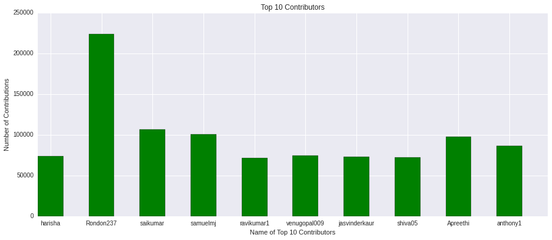
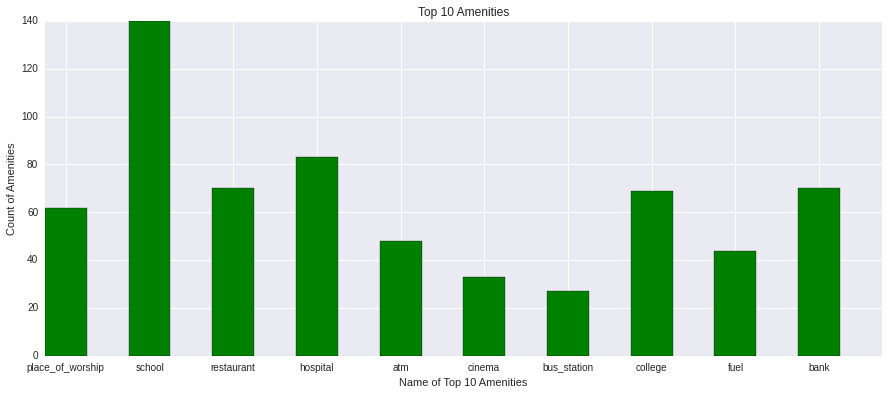

# P3: Wrangle Open Street Map Data


**Map Area**      City Kolkata, Hāora, West Bengal, India <br>
**Map Data**  https://s3.amazonaws.com/metro-extracts.mapzen.com/kolkata_india.osm.bz2<br>
**Map Boundary**

    minlat="22.117" 
    minlon="87.751" 
    maxlat="23.106" 
    maxlon="89.119"
    

# 1.Problems in the Data

** To prepare the data for MongoDB we first take a sample of the data and save it to kolkata_sample.osm **


```python
import xml.etree.ElementTree as ET  # Use cElementTree or lxml if too slow

OSM_FILE = "kolkata_india.osm"  # Replace this with your osm file
SAMPLE_FILE = "kolkata_india_sample.osm"

k = 10 # Parameter: take every k-th top level element

def get_element(osm_file, tags=('node', 'way', 'relation')):
    """Yield element if it is the right type of tag

    Reference:
    http://stackoverflow.com/questions/3095434/inserting-newlines-in-xml-file-generated-via-xml-etree-elementtree-in-python
    """
    context = iter(ET.iterparse(osm_file, events=('start', 'end')))
    _, root = next(context)
    for event, elem in context:
        if event == 'end' and elem.tag in tags:
            yield elem
            root.clear()


with open(SAMPLE_FILE, 'wb') as output:
    output.write('<?xml version="1.0" encoding="UTF-8"?>\n')
    output.write('<osm>\n  ')

    # Write every kth top level element
    for i, element in enumerate(get_element(OSM_FILE)):
        if i % k == 0:
            output.write(ET.tostring(element, encoding='utf-8'))

    output.write('</osm>')
```

** Next we try to find some existing problems in the data **

### 1.1 Invalid Postcodes :

First when I checked the sample and iterated through the sample I didnt found any inconsistent post codes but there are some incorrect post codes in the dataset . In India PostCode size is suppose to be 6 so we check every record to find if there is any invalid post code .


```python
import xml.etree.ElementTree as ET
et_parse_data=ET.iterparse('kolkata_india_sample.osm') #the complete dataset
count=0
def isPostCodeValid(postcode):
    return len(postcode.encode('ascii','ignore').replace(' ',''))==6 #striping off unicode characters

for _,elem in et_parse_data:
    count+=1
    for t in elem.iter('tag'):
        if 'addr' in t.attrib['k']:
            if 'postcode' in t.attrib['k']:
                #print t.attrib['v']
                if not isPostCodeValid(t.attrib['v']):
                    print 'wrong_postalcode->',t.attrib['v']
```

    wrong_postalcode-> 70107
    wrong_postalcode-> 70107
    wrong_postalcode-> 70107


### 1.2 Incorrect use of Address Fields

I'm found a lot of addresses were inconsistence . Information from other fields were stacked in a single field like the following examples where **'addr:housename'** consisted 'Street name','Area', 'Postal Code', 'City' , 'State'


```python
import xml.etree.ElementTree as ET
import re

#postalcode regex
postal_code=re.compile(r'.*(\d{6}).*$')


et_parse_data=ET.iterparse('kolkata_india_sample.osm')
count=0
for _,elem in et_parse_data:
    count+=1
    for t in elem.iter('tag'):
        if 'addr' in t.attrib['k']:
            if 'housename' in t.attrib['k']:
                m=postal_code.match(t.attrib['v'])
                if m:
                    print t.attrib['k']+' : '+t.attrib['v']
                    print 'postal_code in housename',m.groups()
            #print t.attrib['k']+' : '+t.attrib['v']

```

    addr:housename : GD-381, GD Block, Salt Lake City Kolkata, West Bengal 700106‎
    postal_code in housename (u'700106',)
    addr:housename : GD-381, GD Block, Salt Lake City Kolkata, West Bengal 700106‎
    postal_code in housename (u'700106',)
    addr:housename : GD-381, GD Block, Salt Lake City Kolkata, West Bengal 700106‎
    postal_code in housename (u'700106',)


### 1.3 Abbreviated Street Names 
We find that many of the addresses have abbreviated street names like 'Rd' for 'Road' ,'St' for 'Street' etc 


```python
import xml.etree.ElementTree as ET
import re

#street_type regex
street_type_re = re.compile(r'\b\S+\.?$', re.IGNORECASE)


et_parse_data=ET.iterparse('kolkata_sample.osm')
count=0
#street mapping
mapping = { "St": "Street",
            "St.": "Street",
            "Rd":"Road",
            "Rd.":"Road",
            "Ave":"Avenue",
            "Ave.":"Avenue",
            "Expy":"Expressway",
            "Hwy":"Highway"
}

def abbr_street_type(street_name):
    m = street_type_re.search(street_name)
    if m:
        street_type = m.group()
        if street_type in mapping:
            print street_type,'--------',street_name

            
for _,elem in et_parse_data:
    count+=1
    for t in elem.iter('tag'):
        if 'addr' in t.attrib['k']:
            if 'street' in t.attrib['k']:
                abbr_street_type(t.attrib['v'])

```

    St -------- 41, Jawaharlal Nehru Road, Middleton Row, Middleton St
    St -------- 41, Jawaharlal Nehru Road, Middleton Row, Middleton St
    Rd -------- Hana Para Rd
    Rd -------- Hana Para Rd
    St -------- 41, Jawaharlal Nehru Road, Middleton Row, Middleton St
    Rd -------- Hana Para Rd


# 2. Preparing the Data for MongoDB 

Now to prepare the data for Mongo DB first we have to fix the problems in the data 
    
**Invalid Postcodes  :  ** Correct the post code<br>
**Incorrect use of Address Fields  :  ** We just extract the postcode and create a new field post code in the node<br>
**Abbreviated Street Names  :  ** We replace the abbreviations with full text


```python
import xml.etree.ElementTree as ET
import codecs
import re
from collections import defaultdict
import json

#regex
postal_code=re.compile(r'.*(\d{6}).*$')
lower = re.compile(r'^([a-z]|_)*$')
lower_colon = re.compile(r'^([a-z]|_)*:([a-z]|_)*$')
problemchars = re.compile(r'[=\+/&<>;\'"\?%#$@\,\. \t\r\n]')
street_type_re = re.compile(r'\b\S+\.?$', re.IGNORECASE)


#street mapping
mapping = { "St": "Street",
            "St.": "Street",
            "Rd":"Road",
            "Rd.":"Road",
            "Ave":"Avenue",
            "Ave.":"Avenue",
            "Expy":"Expressway",
            "Hwy":"Highway"
}

#function to validate the postcode 
def validate_postcode(postcode):
    #strip any unicode charactars from the postcode and whitespaces
    postcode_norm=postcode.encode('ascii','ignore').replace(' ','')
    if len(postcode_norm)==6:
        return postcode_norm
    if len(postcode_norm)>6:
        return postcode_norm[:3]+postcode_norm[-3:]
    if len(postcode_norm)<6:
        return postcode_norm[:2]+'0'+postcode_norm[-3:]
    
#refine housename just strip the postcode and return the postcode with the data
def refine_housename(housename):
    housename=housename.encode('ascii','ignore')
    m=postal_code.match(housename)
    if m:
        return housename.replace(m.groups()[0],''),m.groups()[0]
    else:
        return housename,None

#Refine street name 
def refine_street_name(street_name):
    m = street_type_re.search(street_name)
    if m:
        street_type = m.group()
        if street_type in mapping:
            street_name=street_name.replace(street_type,mapping[street_type])
    
    return street_name


#shape the data for our MongoDB 
def shape_element(element):
    node = {}
    if element.tag == "node" or element.tag == "way" :
        
        node['id']=element.attrib['id']
        node['type']=element.tag
        node['visible']=True
        
        if 'lat' in element.attrib:
            node['pos']=list((float(element.attrib['lat']),float(element.attrib['lon'])))
        
        if 'visible' in element.attrib:
            node['visible']=element.attrib['visible']
        
        if element.tag=="way":
            node['node_refs']=[]
            for t in element.iter('nd'):
                node['node_refs'].append(t.attrib['ref'])
        
        addr={}
        for t in element.iter('tag'):
            if lower.match(t.attrib['k']):
                node[t.attrib['k']]=t.attrib['v']
            elif lower_colon.match(t.attrib['k']):
                if t.attrib['k'].split(':')[0]=='addr':
                    if t.attrib['k'].split(':')[1]=='street':
                        addr[t.attrib['k'].split(':')[1]]=refine_street_name(t.attrib['v'])
                    elif t.attrib['k'].split(':')[1]=='postcode':
                        addr[t.attrib['k'].split(':')[1]]=validate_postcode(t.attrib['v'])
                    elif t.attrib['k'].split(':')[1]=='housename':
                        hname,postcode=refine_housename(t.attrib['v'])
                        addr[t.attrib['k'].split(':')[1]]=hname
                        addr['postcode']=postcode
                    else:
                        addr[t.attrib['k'].split(':')[1]]=t.attrib['v']
        
        if len(addr)!=0:
            node['address']=addr
        
        created={}
        created_keys=["changeset","user","version","uid", "timestamp"]
        for k,v in element.attrib.iteritems():
            if k in created_keys:
                created[k]=v
        node['created']=created
        
        return node
    else:
        return None

#process osm map file and append write to json
def process_map(file_in, pretty = False):
    # You do not need to change this file
    file_out = "{0}.json".format(file_in)
    count=defaultdict(int)
    with codecs.open(file_out, "w") as fo:
        for _, element in ET.iterparse(file_in): 
            count[element.tag]+=1
            el = shape_element(element)
            if el:
                if pretty:
                    fo.write(json.dumps(el, indent=2)+"\n")
                else:
                    fo.write(json.dumps(el) + "\n")
            #else it will eat all your ram :) 
            if element.tag=='node' or element.tag=='way':
                element.clear()
            
    
    print count,' endpoints processed . . .'


```


```python
process_map('kolkata_india_sample.osm')
```

    defaultdict(<type 'int'>, {'node': 307338, 'nd': 370641, 'member': 665, 'tag': 69976, 'relation': 130, 'way': 63513, 'osm': 1})  endpoints processed . . .


**Now we process the full data**


# 3.Data Overview
Now we import the json to MongoDB
<br>

** mongoimport -db project -c kol --file kolkata_india.osm.json**


```python
#setup db
from pymongo import MongoClient
import pymongo
import matplotlib.pyplot as plt
import pandas as pd
import numpy as np
import seaborn as sns
client = MongoClient('localhost:27017')
db = client['project'] 
```


```python
#The number of records in db
db.kol.find().count()
```


    3158923


```python
#Number of nodes in db
db.kol.find({"type":"node"}).count()
```


    3073375


```python
#Number of ways in db
db.kol.find({"type":"way"}).count()
```


    85547


```python
#number of unique users
len(db.kol.distinct("created.user"))
```


    388


```python
#number of amenities 
db.kol.count({'amenity':{'$exists':1}})
```


    948


```python
#number of unique amenity 
len(db.kol.distinct("amenity"))
```


    50


# 4. Additional Ideas

## Improving The Data

** The main improvement can be done in the 'addr:housename' part as it contains whole address in some of nodes**<br>
 The improvement could be done manually or programitically using data from the neighbouring nodes.<br>
**Populating missing fields with nearby neighbours data**<br>
 We can populate the missing fields of a particular node using the data from the neighbouring nodes.
 <br>
**Listing of popular ametinites using third party APIs **

** Organize Transportation and Population Datas**
<br>
Traffic Data for various Roads, Highways . Transport stops like Metros,Bus Stops,Train Stations can be implemented to the dataset

** shortfall ** 
It is tough to crowdsource traffic datas realtime 

## Analyzing The Data

### Top 10 Contributors


```python
#top #10 contributor 
top10=db.kol.aggregate([{"$group":{"_id":"$created.user", "count":{"$sum":1}}}, {"$sort":{"count":-1}}, {"$limit":10}])
plot_dict={}
for d in list(top10):
    plot_dict[d['_id'].encode('ascii','ignore')]=d['count']
plot_dict

```


    {'Apreethi': 97814,
     'Rondon237': 224135,
     'anthony1': 86152,
     'harisha': 73851,
     'jasvinderkaur': 73103,
     'ravikumar1': 71253,
     'saikumar': 106549,
     'samuelmj': 100463,
     'shiva05': 71963,
     'venugopal009': 74821}


```python
#plotting top 10 contributors
%pylab inline
pylab.rcParams['figure.figsize'] = (15, 6)
plt.bar(np.arange(10),plot_dict.values(),0.5,color='g')
plt.xticks(np.arange(10) + .25, plot_dict.keys())
plt.xlabel('Name of Top 10 Contributors')
plt.ylabel('Number of Contributions')
plt.title('Top 10 Contributors')
plt.show()

```

    Populating the interactive namespace from numpy and matplotlib





### Top 10 Amenities


```python
top10_am=db.kol.aggregate([{"$match":{"amenity":{"$exists":1}}},{"$group":{"_id":"$amenity", "count":{"$sum":1}}}, {"$sort":{"count":-1}}, {"$limit":10}])
plot_dict={}
for d in list(top10_am):
    plot_dict[d['_id'].encode('ascii','ignore')]=d['count']

# when I store the list in a dictonary the order gets lost :( 
plot_dict
```


    {'atm': 48,
     'bank': 70,
     'bus_station': 27,
     'cinema': 33,
     'college': 69,
     'fuel': 44,
     'hospital': 83,
     'place_of_worship': 62,
     'restaurant': 70,
     'school': 140}


```python
#plotting top 10 contributors
%pylab inline
pylab.rcParams['figure.figsize'] = (15, 6)
plt.bar(np.arange(10),plot_dict.values(),0.5,color='g')
plt.xticks(np.arange(10) + .25, plot_dict.keys())
plt.xlabel('Name of Top 10 Amenities ')
plt.ylabel('Count of Amenities')
plt.title('Top 10 Amenities')
plt.show()

```

    Populating the interactive namespace from numpy and matplotlib





### Amenitites Near A Location

I have '2d' index on 'pos' on kol_sample database ( I have a 32 Bit system and the full database is large so MongoDB won't allow me to have '2d' index on the full Database so instead I use the sample_database)


```python
from bson.son import SON
db = client['project_sample']


# the function takes 3 arguments , Location , Amenity Type and Max Distanace and returns the amenities near a location
def findAmenities(pos,am_type,max_dist):
    return list(db.kol_sample.find({'pos':SON([('$near',pos),('$maxDistance',max_dist/111.2)]),'amenity':am_type}))
    
print findAmenities([22.1240911, 87.997864],'restaurant',50)
    
```

    [{u'cuisine': u'regional', u'amenity': u'restaurant', u'capacity': u'100', u'name': u'Sher-e-Punjab', u'created': {u'changeset': u'30018617', u'version': u'1', u'user': u'samit_53', u'timestamp': u'2015-04-06T15:48:16Z', u'uid': u'2297171'}, u'takeaway': u'yes', u'pos': [22.4321327, 87.8691153], u'visible': True, u'address': {u'housenumber': u'Kolaghat', u'postcode': u'721134'}, u'_id': ObjectId('5785663bda7b71a0c5601ca9'), u'type': u'node', u'id': u'3441160022'}]


**One of the Limitation of this function is that it only searches among the 'nodes' most of amenity was in the 'way' types so it don't show the amenities which are in the type 'way'. the 'way' don't have the field 'pos' because it references the 'node'.**


```python

```
