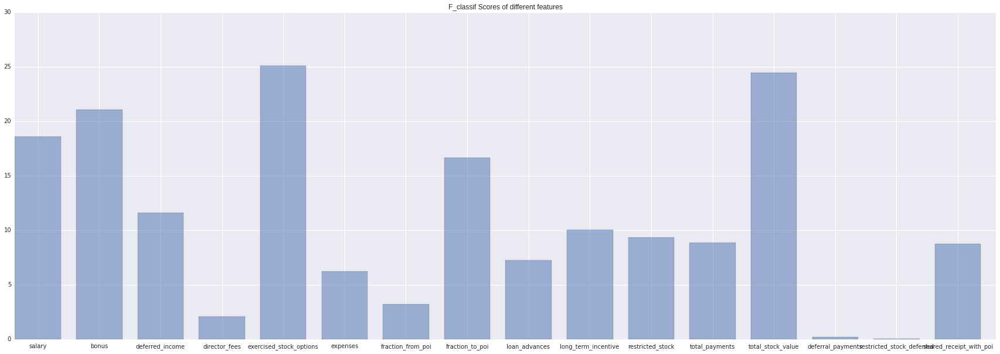

# P5: Identify Fraud from Enron Email

In 2000, Enron was one of the largest companies in the United States. By 2002, it had collapsed into bankruptcy due to widespread corporate fraud. In the resulting Federal investigation, a significant amount of typically confidential information entered into the public record, including tens of thousands of emails and detailed financial data for top executives. 

## 1.Goal of the Project 


The goal of this project is to build a predictive model using the enron financial dataset and the email dataset which can predict Person of Interest who are not already marked as a Person of Interest . Here I will try to select the most import features that will helps us predict the Enron Person of Interest. <br>
    
**The Dataset**<br>

The dataset have information of *146 rows* each having *21 fields* . There are already *18 Person of Interest* marked in the Dataset . I will use the features of those 18 POIs to predict other POIs 
<br>

**Sample Data Point**<br>

    {'bonus': 600000,
     'deferral_payments': 'NaN',
     'deferred_income': 'NaN',
     'director_fees': 'NaN',
     'email_address': 'mark.metts@enron.com',
     'exercised_stock_options': 'NaN',
     'expenses': 94299,
     'from_messages': 29,
     'from_poi_to_this_person': 38,
     'from_this_person_to_poi': 1,
     'loan_advances': 'NaN',
     'long_term_incentive': 'NaN',
     'other': 1740,
     'poi': False,
     'restricted_stock': 585062,
     'restricted_stock_deferred': 'NaN',
     'salary': 365788,
     'shared_receipt_with_poi': 702,
     'to_messages': 807,
     'total_payments': 1061827,
     'total_stock_value': 585062}
 <br>
 
**Outliers**<br>
<br>
<br>
After I plot a scatterplot using 'salary' and 'bonus' I easily detect the outlier with key 'TOTAL' which stores the total value of the all the data points . So I just delete the 'TOTAL' data point from our dataset.<br>

And after I deleted the 'TOTAL' I still saw some data_points with realatively high values when I inspect the dataset and found those points represent the big bosses of Enron and they are some of the POIs . So we keep those outliers .

## 2.Feature Selection and Scaling

In our case every data point have 21 fields and for missing values it is marked as 'NaN' . Every field is a potential feature but we will inspect the data through various visualizations <br>
**Adding New Features**<br>
We add two new fields to each of our datapoints. **fraction_to_messages** and **fraction_from_messages** .
    
    fraction_to_messages=from_this_person_to_poi/from_messages
    fraction_from_messages=from_poi_to_this_person/to_messages
    
 <br>
These to fields store the fraction of the emails send to poi and received from poi.<br>

**Selecting Best Five Features**<br>
There are 20 + 2 fields now, but some of the fields don't have any effect on whether the person is a Person of Interest or not .Now I chose 13 features from the 22 and pass them to *sklearn* **SelectKBest()** where **f_classif** is the scoring algorithm.<br>

    'poi'                     'salary'                   'bonus'        
    'deferred_income'         'director_fees'            'exercised_stock_options'  
    'expenses'                'fraction_from_poi'        'fraction_to_poi'
    'loan_advances'           'long_term_incentive'      'restricted_stock'
    'total_payments'          'total_stock_value'

*Scores of Each Feature*<br>

<br> <br>


*The Top Five Features*

    Feature Name                  Score
    ------------                  -----
    exercised_stock_options       25.0975415287
    total_stock_value             24.4676540475
    bonus                         21.0600017075
    salary                        18.575703268
    fraction_to_poi               16.6417070705
    
    
**Feature Scaling**<br>
Now I used to Sklearn *MinMaxScaler()* to scale my best five features in the range(0,1).


## 3.Algorithm Selection

        GaussianNB
        LinearSVC
        DecisionTree
        AdaBoost

****

 **GaussianNB Performance**

    Precision  0.5
    Recall  0.6
    F1_score  0.545454545455

**Dtree Performance**

    Precision  0.333333333333
    Recall  0.4
    F1_score  0.363636363636
    
**LinearSVC Performance**

    Precision  0.0
    Recall  0.0
    F1_score  0.0
    
    
Here we can See **GaussianNB** performs better than **Decision Tree**. So we will use **GaussianNB** for our project. 

 ##  4.Algorithm Parameter Tuning

Using Sklearn **GridSearchCV** I found the best parameters for Decision Tree are
****

**Decision Tree Performance**

    Precision  0.4
    Recall  0.4
    F1_score  0.4

    
**Best Parameters**

    min_samples_split: 3
    criterion: 'entropy'
    min_samples_leaf: 8
    class_weight=None
    max_depth=None
    

## 5.Validation
Validation is the process of testing a model with known inputs and test various factors on how well the model can identify unknown inputs.<br>
The common mistake one can do while validating is using the same data for Training and Testing purpose.<br>
Here we split the total dataset with 30% in the test set and 70% in the training Set.

## 6.Evaluation Metrics

Here we use the  **StratifiedShuffleSplit** to shuffle our dataset for 1000 folds . We find 2 Metrics about our model . <br>

    Mean Precision: 0.43315	
    Mean Recall: 0.34500
    
The precision is intuitively the ability of the classifier not to label as positive a sample that is negative.<br>
The recall is intuitively the ability of the classifier to find all the positive samples.<br>

A system with high recall but low precision returns many results, but most of its predicted labels are incorrect when compared to the training labels. A system with high precision but low recall is just the opposite, returning very few results, but most of its predicted labels are correct when compared to the training labels. An ideal system with high precision and high recall will return many results, with all results labeled correctly.


sources :

    http://scikit-learn.org/stable/modules/classes.htm
    http://scikit-learn.org/stable/auto_examples/model_selection/plot_precision_recall.html


```python

```
