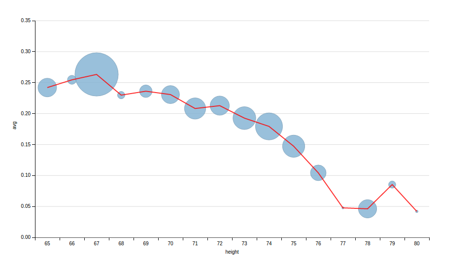
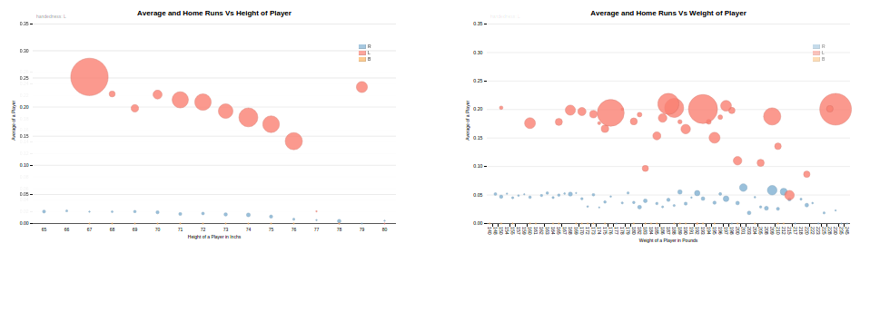

#P6: Make Effective Data Visualization

## Summary 
The project have two graphs to illustrate the relation of Average , Home Runs with Height and Average , Home Runs with Weight .
The visualization also tries to use Animation to visualize the realtion of different Handedness .

## Design 

The X axis is the Height in inchs and the Y axis is the mean average and the size of Each bubble potrays the Home Runs.

</img>

## Feedback

### Feedback 1:
The visualization don't have proper titles or axis and title for chart . Consider adding title and Legends for the chart .

### Feedback 2:
The visualization only show the realtion of Average and HomeRuns with Height consider adding another Chart to potray the same 
against Weight of a player.

### Feedback 3:
The visualization lacks information about the Handedness of a Batsman Consider adding the handedness to the chart.

### Post Feed Back Vizualization

</img>

## Resources

    http://dimplejs.org/
    http://dimplejs.org/advanced_examples_viewer.html?id=advanced_storyboard_control
    http://stackoverflow.com/a/25422021/3832190

